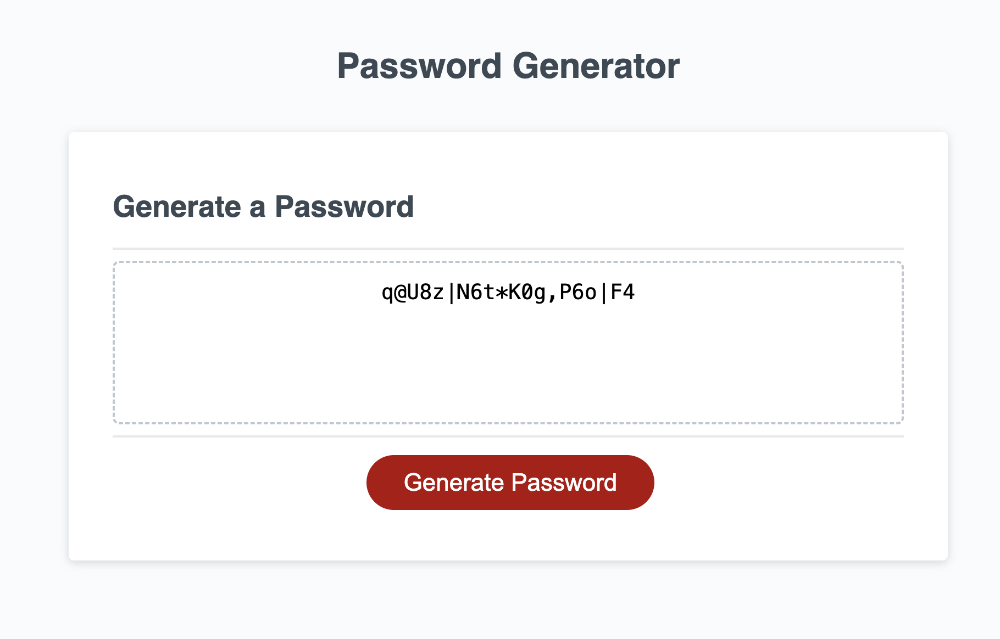

# JavaScript: Password Generator - HW3

## Goal

To create a password generator using the given HTML and CSS in order to best practice JavaScript skills. 

The following image shows the web application's appearance and functionality given:

The following image shows the result: 

